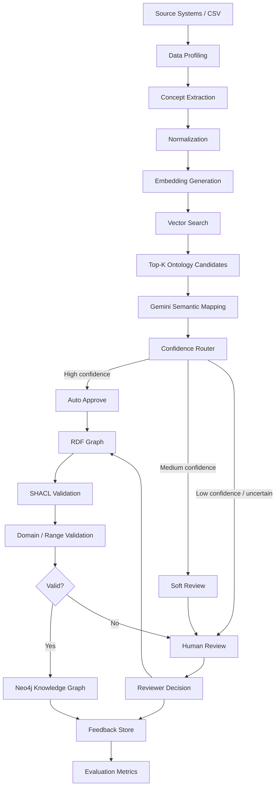

# Graph Schema Intelligence System (GSIS)

## Published snapshot and local files

This repository contains the GSIS source, ontology, and validation shapes.
Local employee data, processed data, generated outputs, virtual environments,
credentials, and backup files are intentionally excluded. The original local
README describes a 10,000-row synthetic dataset; that dataset is **not included**
in this published snapshot. Supply an approved local CSV at
`data/raw/employee_10k.csv` before running the pipeline. Required columns are
listed in `src/ingest.py`; later stages also use additional employee attributes.

For Neo4j, set the environment variables shown below, or copy
`config/neo4j.example.json` to `config/neo4j.json` and fill in your credentials
locally. The latter file is ignored by Git. `.env.example` is a reference only:
these scripts do not automatically load `.env` files.

The local dependency list also needs `sentence-transformers` for embeddings
and `pyshacl` for SHACL validation. Install them before running those stages:

```powershell
pip install sentence-transformers pyshacl
```

No test files were present in this source snapshot. Python syntax was checked
before publication; the complete pipeline and external services were not run.


A portfolio-ready semantic schema intelligence pipeline for detecting entity misclassification, duplicate ontology concepts, schema conflicts, and invalid Knowledge Graph relationships before production ingestion.

This project uses **10,000 rows of fully synthetic enterprise employee data** so the complete architecture can be demonstrated safely without exposing proprietary or production data.

---

## Project Overview

Enterprise source systems often represent the same business concept differently.

For example:

```text
Engineering
ENG
Engg
Engineerng
Software Engineering
```

If these values are directly ingested into a Knowledge Graph, they can create duplicate concepts, inconsistent relationships, and poor data quality.

GSIS solves this by combining:

- Data profiling
- Schema discovery
- Concept extraction
- Label normalization
- Ontology engineering
- Embeddings
- Vector similarity search
- Gemini-assisted semantic mapping
- Confidence-based routing
- RDF / OWL modeling
- SHACL validation
- Domain / range validation
- Human-in-the-loop review
- Neo4j graph ingestion
- Feedback and evaluation

---

## Tech Stack

**Semantic Web & Knowledge Graph**

- RDF
- OWL
- SHACL
- SPARQL
- Neo4j
- Cypher

**AI / Semantic Retrieval**

- Gemini
- Embeddings
- Vector Search
- Sentence Transformers

**Programming & Data**

- Python
- Pandas
- NumPy
- RDFLib
- Pydantic

**Cloud-ready Architecture**

- Vertex AI
- Gemini on Vertex AI
- Vector Search
- GCP

---

## 15-Stage GSIS Pipeline

```text
1.  Source Data Ingestion
        ↓
2.  Data Profiling
        ↓
3.  Schema Discovery
        ↓
4.  Concept Extraction
        ↓
5.  Label Normalization
        ↓
6.  Ontology Candidate Retrieval
        ↓
7.  Embedding Generation
        ↓
8.  Vector Similarity Search
        ↓
9.  Gemini Semantic Mapping
        ↓
10. Confidence Routing
        ↓
11. RDF Graph Generation
        ↓
12. SHACL + Domain/Range Validation
        ↓
13. Human Review Workflow
        ↓
14. Neo4j Knowledge Graph Loading
        ↓
15. Feedback + Evaluation Loop
```

---

## Architecture



---

## Example Semantic Mapping

Incoming source concept:

```text
Engineerng
```

Vector retrieval:

```text
1. Engineering         0.94
2. Data & Analytics    0.41
3. Operations          0.33
```

Semantic mapper:

```json
{
  "source_value": "Engineerng",
  "decision": "reuse",
  "selected_concept_id": "D001",
  "selected_label": "Engineering",
  "confidence": 0.96,
  "risk_flags": []
}
```

Routing result:

```text
AUTO_APPROVE
```

---

## Confidence Routing

Development routing logic:

```text
>= 0.90
AUTO_APPROVE
when no severe semantic risk is present

0.70 – 0.89
SOFT_REVIEW

< 0.70
HUMAN_REVIEW
```

The following decisions always require human review:

```text
create_new
uncertain
```

These thresholds are development defaults and should be calibrated using evaluation data in a production implementation.

---

## Deterministic Semantic Validation

Gemini is used for semantic reasoning, but it is not the final authority.

Example ontology rule:

```text
reportsTo

domain = Employee
range  = Employee
```

Valid:

```text
Employee
   ↓ reportsTo
Employee
```

Invalid:

```text
Employee
   ↓ reportsTo
Department
```

GSIS uses **SHACL, SPARQL, and ontology domain/range constraints** to block structurally invalid mappings even when an AI model assigns high confidence.

---

## Why Vector Search Before Gemini?

A large enterprise ontology may contain thousands of concepts.

Instead of sending the entire ontology to an LLM:

```text
Large Ontology
     ↓
Gemini
```

GSIS uses:

```text
Large Ontology
     ↓
Embeddings
     ↓
Vector Search
     ↓
Top-K candidates
     ↓
Gemini
```

This reduces:

- Token usage
- Latency
- Cost
- Candidate ambiguity
- Unnecessary ontology duplication

---

## Human-in-the-Loop Workflow

Mappings routed to:

```text
SOFT_REVIEW
HUMAN_REVIEW
```

are written to:

```text
outputs/review/human_review_queue.csv
```

A reviewer can provide:

- Final decision
- Correct ontology concept
- Correct label
- Review comment
- Review status

Completed corrections are stored in the feedback dataset and can later be reused as retrieval context for future semantic mapping.

---

## Neo4j Graph Model

Core node types:

```text
Employee
Department
Location
JobRole
Organization
```

Example relationships:

```text
(Employee)-[:WORKS_IN]->(Department)

(Employee)-[:REPORTS_TO]->(Employee)

(Employee)-[:LOCATED_IN]->(Location)

(Employee)-[:HAS_ROLE]->(JobRole)
```

---

## Project Structure

```text
gsis-project/
|-- config/neo4j.example.json
|-- data/raw/              # local input data (ignored)
|-- data/processed/        # generated data (ignored)
|-- ontology/
|   |-- department_catalog.json
|   `-- organization_ontology.ttl
|-- shapes/employee_shapes.ttl
|-- src/                   # pipeline stages and supporting modules
|-- outputs/               # generated results (ignored)
|-- .env.example
|-- .gitignore
|-- requirements.txt
`-- README.md
```

---

## Local Setup

### 1. Clone the repository

```bash
git clone YOUR_REPOSITORY_URL
cd gsis-project
```

### 2. Create a virtual environment

Windows:

```powershell
python -m venv .venv
.venv\Scripts\activate
```

### 3. Install dependencies

```powershell
python -m pip install --upgrade pip
pip install -r requirements.txt
```

---

## Validation

No automated test suite is included in this source snapshot.

---

## Run Stages 1–5

```powershell
python src/run_stage_1_5.py
```

This performs:

- Data ingestion
- Data profiling
- Schema discovery
- Concept extraction
- Label normalization

---

## Run Stages 6–8

```powershell
python src/run_stage_6_8.py
```

This performs:

- Ontology loading
- Embedding generation
- Vector similarity retrieval

Review candidate quality:

```powershell
python src/review_vector_results.py
```

---

## Run Stages 9–10

For the local deterministic demo:

```powershell
python src/run_stage_9_10.py --mode mock
```

This performs:

- Semantic mapping
- Confidence routing

The project also includes a Gemini-enabled mapping mode.

Do not commit API keys to GitHub.

---

## Run Stages 11–12

```powershell
python src/run_stage_11_12.py
```

This performs:

- RDF graph generation
- SHACL validation
- Domain/range validation
- Semantic collision detection

---

## Run Stage 13

```powershell
python src/human_review.py
```

Review:

```text
outputs/review/human_review_queue.csv
```

After completing reviewer fields:

```powershell
python src/apply_review.py
```

---

## Run Stage 14 — Neo4j

Set credentials locally:

```powershell
$env:NEO4J_URI="neo4j://localhost:7687"
$env:NEO4J_USER="neo4j"
$env:NEO4J_PASSWORD="YOUR_PASSWORD"
```

Then:

```powershell
python src/neo4j_loader.py
```

---

## Example Cypher Queries

### Preview employees

```cypher
MATCH (e:Employee)
RETURN e
LIMIT 25;
```

### Employees by department

```cypher
MATCH (e:Employee)-[:WORKS_IN]->(d:Department)
RETURN d.label AS department,
       count(e) AS employees
ORDER BY employees DESC;
```

### Top managers

```cypher
MATCH (e:Employee)-[:REPORTS_TO]->(m:Employee)
RETURN m.full_name AS manager,
       count(e) AS direct_reports
ORDER BY direct_reports DESC
LIMIT 10;
```

---

## Run Stage 15

Build feedback store:

```powershell
python src/feedback_loop.py
```

Evaluate semantic mapping:

```powershell
python src/evaluate_pipeline.py
```

Metrics include:

- Overall mapping accuracy
- Auto-approved mappings
- Soft-review mappings
- Human-review mappings
- Auto-approval accuracy

---

## Key Output Files

```text
outputs/data_profile.json

data/processed/extracted_concepts.csv

outputs/department_vector_candidates.csv

outputs/gemini_mapping_decisions.json

outputs/mapping_routing_decisions.csv

outputs/employees.ttl

outputs/collisions/domain_range_collisions.json

outputs/collisions/collision_report.json

outputs/validation/shacl_report.ttl

outputs/review/human_review_queue.csv

outputs/review/mapping_feedback_store.csv

outputs/metrics/evaluation_summary.json
```

---

## Synthetic Dataset

The repository uses **10,000 synthetic employee records**.

Intentional data-quality and semantic issues include:

- Entity misclassification
- Misspelled department names
- Aliases and abbreviations
- Unknown department concepts
- Missing departments
- Missing emails
- Duplicate email signals
- Invalid manager references
- Self-referencing managers
- Invalid relationship types
- Non-standard job titles

This allows GSIS to demonstrate realistic semantic validation and routing behavior.

---

## Project Summary

A concise explanation:

> GSIS is a semantic schema intelligence pipeline designed to prevent incorrect or duplicate concepts from entering a Knowledge Graph. It profiles and normalizes source concepts, retrieves existing ontology candidates using embeddings and vector search, and uses Gemini as a semantic reasoning layer. Mappings are routed based on confidence, validated deterministically using SHACL and ontology domain/range constraints, and ambiguous cases are sent for human review. Approved entities and relationships are loaded into RDF and Neo4j, while reviewer corrections are stored in a feedback loop for future improvement.

---

## Portfolio / Data Disclaimer

This repository is a learning and portfolio implementation.

All employee and organizational records are synthetic.

No proprietary employer data, production schemas, confidential mappings, API keys, passwords, or customer information should be committed to this repository.

---

## Future Enhancements

- Vertex AI Embeddings
- Managed Vector Search
- Gemini on Vertex AI
- Cloud Storage ingestion
- BigQuery audit tables
- Cloud Run orchestration
- Cloud Logging
- Neo4j Aura
- Reviewer UI
- RAG-based historical feedback retrieval
- Automated ontology versioning
- CI/CD validation
